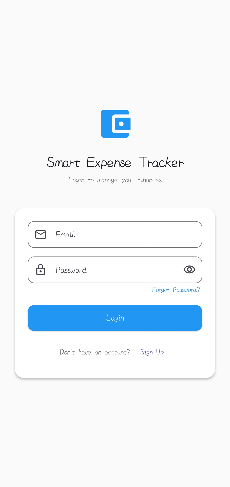
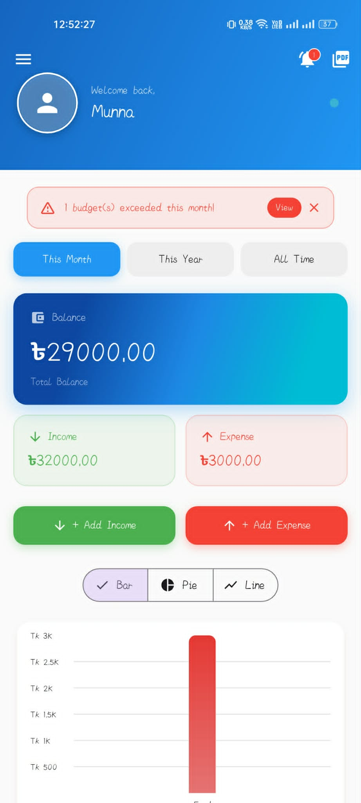
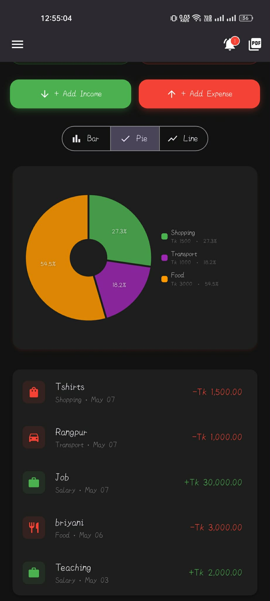
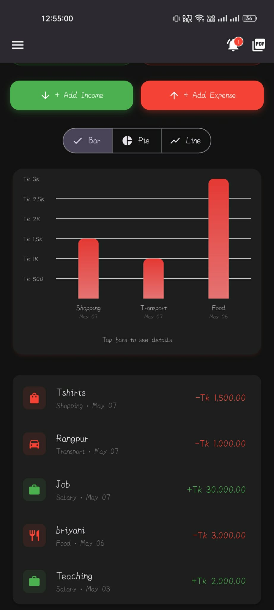
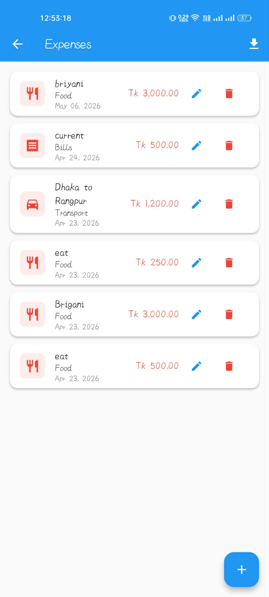
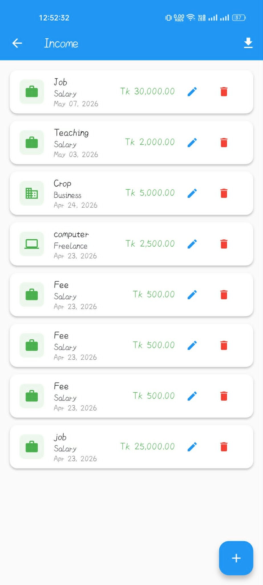
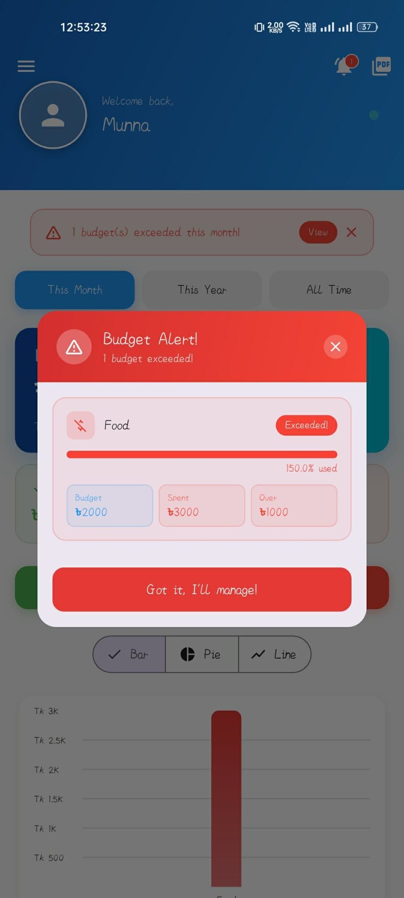
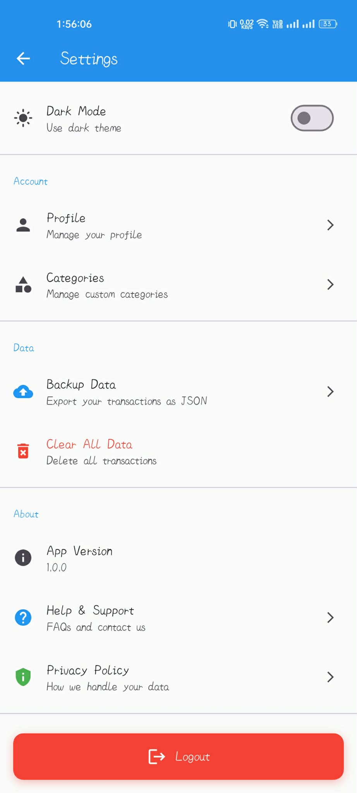
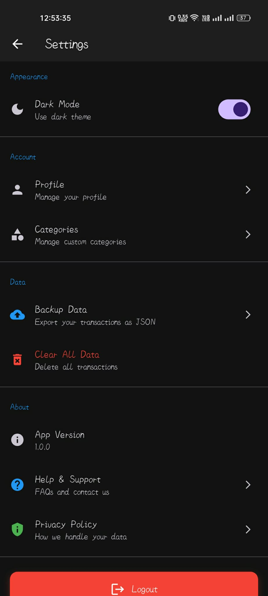

# 💰 Smart Expense Tracker

<p align="center">
  
</p>

<p align="center">
  A full-featured personal finance management mobile application built with <strong>Flutter</strong> and powered by <strong>Firebase</strong>.
</p>

<p align="center">
  
  
  
  
  
</p>

## 📱 App Screenshots

### 🔐 Authentication
<p align="center">
  
</p>

---

### 📊 Dashboard
<p align="center">
  
  
  
</p>

---

### 💸 Transactions
<p align="center">
  
  
</p>

---

### 🎯 Budget & Settings
<p align="center">
  
  
    
</p>

---


## 📖 About

**Smart Expense Tracker** is a cross-platform mobile application that helps users manage their personal finances. Users can log daily income and expenses by category, set monthly budgets with real-time overspending alerts, visualize spending patterns through interactive charts, and export financial reports as PDF or Excel files — all backed by a real-time **Firebase Cloud Firestore** database.

---

## ✨ Features

| # | Feature | Description |
|---|---------|-------------|
| 1 | 🔐 Authentication | Email/password login & signup via Firebase Auth with detailed error handling |
| 2 | 🔑 Password Reset | Password reset email sent directly through Firebase Auth |
| 3 | 📊 Dashboard | Summary cards showing total income, expenses, and balance with interactive chart |
| 4 | 💸 Expense Tracking | Add, view, update, and delete expense transactions with categories |
| 5 | 💵 Income Tracking | Add, view, and delete income entries with source categories |
| 6 | 🎯 Budget Management | Set per-category budgets; warned at 80% usage, alerted at 100% |
| 7 | 📈 Charts | Interactive pie/bar charts for category-wise spending breakdown |
| 8 | 🔍 Search & Filter | Filter transactions by date range, type, and category |
| 9 | 📄 PDF Export | Generate detailed PDF reports (Daily / Monthly / Yearly / All Time) |
| 10 | 📊 Excel Export | Export transaction data to a timestamped `.xlsx` file saved to device |
| 11 | 🌙 Dark Mode | Light and dark themes with preference persisted via SharedPreferences |
| 12 | 👤 Profile Management | Edit display name; profile data stored in Firestore |
| 13 | 🎨 Custom Launcher Icon | Branded adaptive app icon for Android 12+ |
| 14 | 💧 Splash Screen | Branded native splash screen on app launch |

---

## 🛠️ Tech Stack

| Technology | Version | Purpose |
|---|---|---|
| Flutter | ≥ 3.0.0 | Cross-platform UI framework |
| Dart | ≥ 3.0.0 | Programming language |
| Firebase Authentication | ^5.1.4 | User authentication & password reset |
| Cloud Firestore | ^5.2.1 | Real-time NoSQL cloud database |
| Provider | ^6.1.5+1 | State management (ChangeNotifier) |
| fl_chart | ^0.65.0 | Charts and data visualization |
| pdf + printing | ^3.10.7 / ^5.12.0 | PDF generation and native sharing |
| excel | ^4.0.6 | Excel (.xlsx) file export |
| shared_preferences | ^2.5.4 | Theme persistence |
| path_provider | ^2.1.2 | Device file system access |
| intl | ^0.18.1 | Date and number formatting |
| image_picker | ^1.2.1 | Profile image selection |
| share_plus | ^7.2.1 | Native file sharing |
| flutter_native_splash | ^2.3.9 | Branded splash screen |
| flutter_launcher_icons | ^0.13.1 | Custom app icon generation |

---

## 📁 Project Structure

```
expense_tracker/
├── lib/
│   ├── models/
│   │   ├── transaction.dart             # Transaction model with Firestore serialization
│   │   ├── budget.dart                  # Budget & BudgetStatus models
│   │   └── category.dart               # CustomCategory model & CategoryHelper
│   │
│   ├── screens/
│   │   ├── login_screen.dart            # Login with error messages & forgot password
│   │   ├── signup_screen.dart           # User registration screen
│   │   ├── dashboard_screen.dart        # Home: summary cards, chart, recent transactions
│   │   ├── expense_screen.dart          # Expense list, add/edit/delete
│   │   ├── income_screen.dart           # Income list, add/delete
│   │   ├── budget_screen.dart           # Budget setup and progress tracking
│   │   ├── settings_screen.dart         # Profile management, theme toggle, logout
│   │   ├── budget_notification_widget.dart  # Budget overspending alert widget
│   │   └── pdf_download_dialog.dart     # PDF report type selection & generation dialog
│   │
│   ├── services/
│   │   ├── auth_service.dart            # Firebase Auth: login, signup, reset, profile update
│   │   ├── transaction_service.dart     # Firestore CRUD + real-time stream for transactions
│   │   ├── budget_service.dart          # Firestore CRUD + monthly budget status calculation
│   │   ├── category_service.dart        # Firestore CRUD for custom categories
│   │   ├── pdf_service.dart             # PDF generation (daily/monthly/yearly/all-time)
│   │   └── theme_service.dart           # Dark/light theme with SharedPreferences
│   │
│   ├── utils/
│   │   └── excel_export.dart            # Excel file export saved to device documents directory
│   │
│   ├── widgets/
│   │   ├── chart_widget.dart            # fl_chart pie/bar chart component
│   │   ├── recent_transactions.dart     # Latest transactions list view
│   │   ├── search_filter_bar.dart       # Reusable search & filter bar
│   │   ├── summary_card.dart            # Balance / Income / Expense summary cards
│   │   └── transaction_card.dart        # Individual transaction row widget
│   │
│   ├── firebase_options.dart            # Auto-generated Firebase project configuration
│   └── main.dart                        # App entry point: Firebase init & MultiProvider setup
│
├── assets/
│   └── images/
│       └── logo1.png                    # App logo (used for launcher icon & splash screen)
├── android/
├── ios/
├── web/
├── test/
│   └── widget_test.dart
├── firebase.json
├── pubspec.yaml
└── README.md
```

---

## 🚀 Getting Started

### Prerequisites

- [Flutter SDK](https://docs.flutter.dev/get-started/install) `>=3.0.0 <4.0.0`
- [Android Studio](https://developer.android.com/studio) or [VS Code](https://code.visualstudio.com/) with Flutter & Dart extensions
- A [Firebase](https://console.firebase.google.com/) account and project

---

### Installation

**Step 1 — Clone the repository**
```bash
git clone https://github.com/YOUR_USERNAME/expense_tracker.git
cd expense_tracker
```

**Step 2 — Install dependencies**
```bash
flutter pub get
```

**Step 3 — Firebase Setup**

1. Go to [Firebase Console](https://console.firebase.google.com/) → Create a new project
2. Enable **Authentication** → Sign-in method → **Email/Password**
3. Enable **Cloud Firestore** → Start in production mode
4. Run the FlutterFire CLI to auto-configure:
   ```bash
   dart pub global activate flutterfire_cli
   flutterfire configure
   ```
   This generates `lib/firebase_options.dart` automatically.
5. For Android: Download `google-services.json` → place in `android/app/`
6. For iOS: Download `GoogleService-Info.plist` → place in `ios/Runner/`

**Step 4 — Generate splash screen & launcher icon**
```bash
dart run flutter_native_splash:create
dart run flutter_launcher_icons
```

**Step 5 — Run the app**
```bash
flutter run
```

---

### Build Release APK

```bash
flutter build apk --release
```

The APK will be located at:
```
build/app/outputs/flutter-apk/app-release.apk
```

Transfer the file to your Android phone and install it directly.

---

## 🔥 Firebase Configuration

This app uses the following Firebase services:

| Service | Purpose |
|---|---|
| Firebase Authentication | Email/password login, signup, and password reset |
| Cloud Firestore | Stores all user data: transactions, budgets, categories, profiles |

### Recommended Firestore Security Rules
```
rules_version = '2';
service cloud.firestore {
  match /databases/{database}/documents {
    match /users/{userId}/{document=**} {
      allow read, write: if request.auth != null && request.auth.uid == userId;
    }
  }
}
```

> ⚠️ **Important:** Never commit `google-services.json`, `GoogleService-Info.plist`, or `firebase_options.dart` with real credentials to a public repository. Add these files to `.gitignore`.

---

## 📦 Dependencies

```yaml
dependencies:
  firebase_core: ^3.3.0
  firebase_auth: ^5.1.4
  cloud_firestore: ^5.2.1
  provider: ^6.1.5+1
  fl_chart: ^0.65.0
  intl: ^0.18.1
  excel: ^4.0.6
  shared_preferences: ^2.5.4
  pdf: ^3.10.7
  printing: ^5.12.0
  path_provider: ^2.1.2
  cupertino_icons: ^1.0.2
  image_picker: ^1.2.1
  share_plus: ^7.2.1
  flutter_native_splash: ^2.3.9

dev_dependencies:
  flutter_lints: ^3.0.0
  flutter_launcher_icons: ^0.13.1
```

---

## 👨‍💻 Developer

**Your Name**
- GitHub: https://github.com/Munjurul8355 and https://github.com/Murad-08
- Institution: Pundra Univarsity of Science & Technology
- Course: Mobile Application Lab — Final Project (May 2026)

---

## 📄 License

This project was developed as a **Mobile Application Lab** course assignment and is intended for educational purposes only.

---
